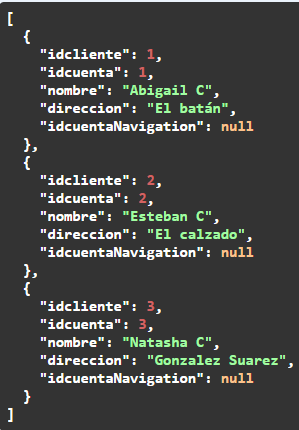

"# BackEnd API CRUD" 

1. The query to create database is the file called QueryDB.sql.
2. In this project we use SQLServer.
3. The API simulates some process that take part between: Client, Accounts and Movements of the Accounts.

- GET Client
Request url: https://localhost:7052/api/Clientes
Request response:

- POST Client

